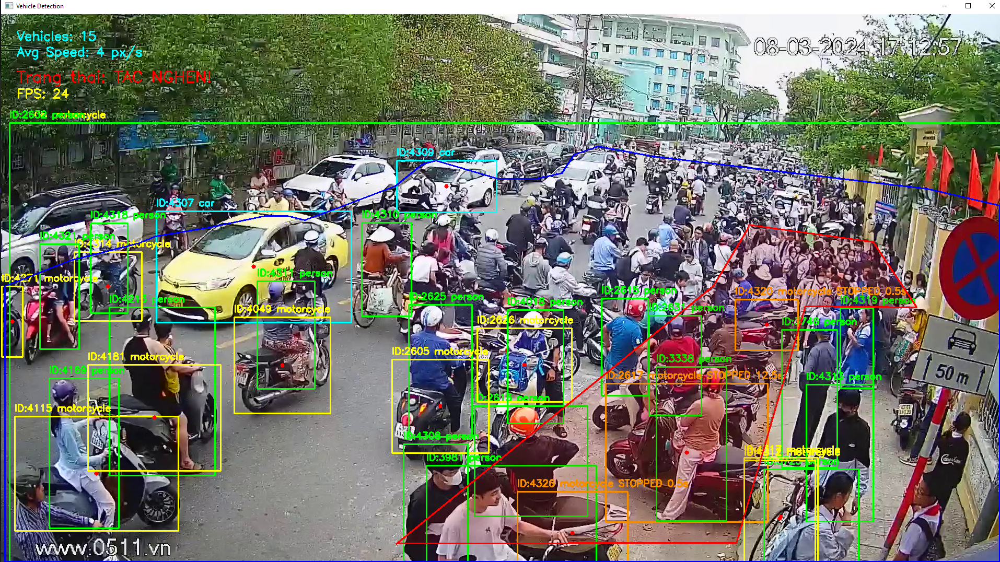
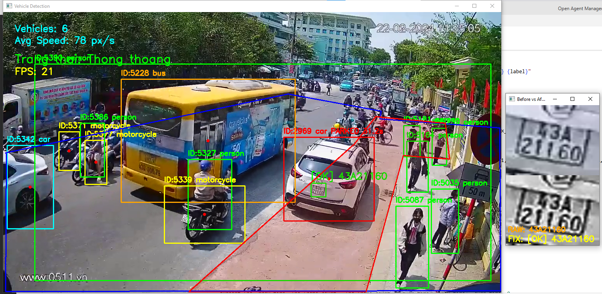
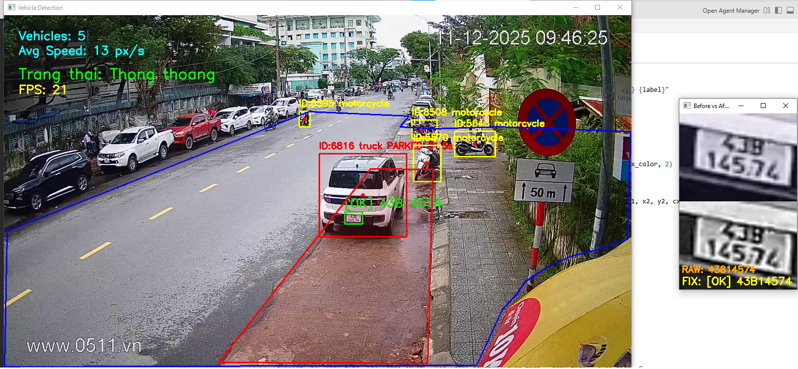
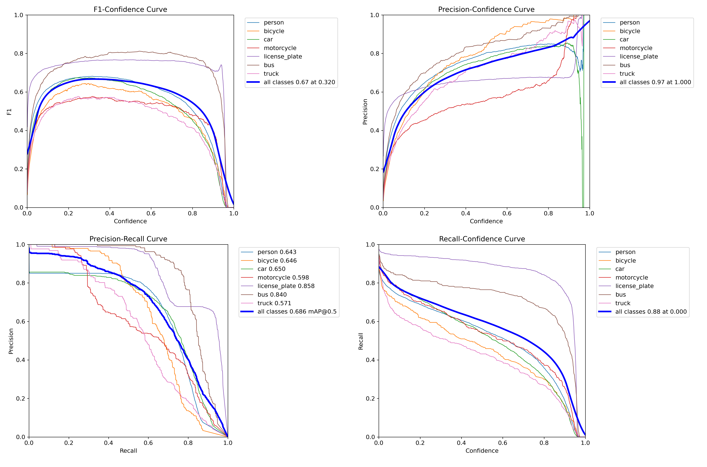

# Vehicle Detection CV
Hệ thống phát hiện và giám sát phương tiện/người trong vùng quan sát (ROI) sử dụng YOLO26 và ByteTrack, hỗ trợ cả PyTorch (.pt) và TensorRT (.engine).

---

## Tính năng
- Phát hiện và tracking phương tiện (car, motorcycle, bus, truck, bicycle) và người (person) trong vùng ROI tự định nghĩa
- Nhận diện biển số xe (license_plate)
- Tính toán **vận tốc trung bình** của phương tiện trong ROI (đơn vị: pixel/giây)
- Đánh giá trạng thái giao thông 3 mức: **Thông thoáng** / **Đông đúc** / **Tắc nghẽn**
- Hỗ trợ **skip frame** (xử lý 1 frame, bỏ qua 1 frame) để tăng tốc độ xử lý
- Hỗ trợ vẽ, lưu và tải lại vùng quan sát (ROI) dưới dạng file JSON
- Hỗ trợ chạy model PyTorch (.pt) và TensorRT (.engine)
- Giao diện đồ họa (GUI) bằng Tkinter

---

## Demo






---

## Yêu cầu hệ thống
- Python 3.10+
- CUDA 12.4
- GPU NVIDIA (khuyến nghị 6GB VRAM trở lên)
- TensorRT 10.x (nếu dùng .engine)

---

## Cài đặt

```bash
pip install ultralytics opencv-python numpy
```

Nếu dùng TensorRT:
```bash
pip install tensorrt==10.6.0
```

---

## Cấu trúc thư mục

```
project/
├── main.py
├── models/
│   ├── yolo26m.pt          # Model PyTorch (medium)
│   ├── yolo26l.pt          # Model PyTorch (large)
│   └── yolo26l.engine      # Model TensorRT (sau khi export)
├── layouts/
│   └── <video_name>.json   # File lưu vùng ROI theo từng video
└── README.md
```

---

## Hướng dẫn sử dụng

### 1. Chạy ứng dụng
```bash
python main.py
```

### 2. Chọn Model
Bấm **"Chọn Model YOLO"** và chọn file `.pt` hoặc `.engine`.

### 3. Chọn Video
Bấm **"Chọn Video"** và chọn file video. Nếu đã có file layout JSON trùng tên video trong thư mục `layouts/`, hệ thống sẽ **tự động tải layout** mà không cần vẽ lại.

### 4. Quản lý vùng quan sát (ROI)

| Nút | Chức năng |
|---|---|
| **Vẽ Vùng Quan Sát** | Mở cửa sổ vẽ polygon ROI trên frame đầu tiên của video |
| **Load Layout** | Tải vùng ROI từ file JSON có sẵn |
| **Hủy Layout** | Xóa vùng ROI hiện tại |

**Phím tắt khi vẽ ROI:**
- **Click trái**: thêm điểm
- **Click phải**: xóa toàn bộ điểm
- **Ctrl+Z**: xóa điểm vừa vẽ
- **Enter**: xác nhận (cần ít nhất 3 điểm)
- **ESC**: hủy

Sau khi vẽ xong, hệ thống hỏi có muốn lưu layout không:
- **Yes**: lưu file JSON vào thư mục `layouts/` và áp dụng
- **No**: áp dụng tạm thời mà không lưu
- **Cancel**: hủy bỏ hoàn toàn

### 5. Bắt đầu nhận diện
Bấm **"Bắt đầu Detect"**. Nhấn **ESC** trong cửa sổ video để dừng.

---

## Thông tin hiển thị trên màn hình

| Thông tin | Màu | Ý nghĩa |
|---|---|---|
| `Vehicles: N` | Vàng | Số phương tiện trong ROI |
| `Avg Speed: N px/s` | Vàng | Vận tốc trung bình của xe |
| `FPS: N` | Cyan | FPS xử lý thực tế |
| `Trang thai: Thong thoang` | Xanh lá | Xe ít, lưu thông tốt |
| `Trang thai: Dong duc` | Cam | Xe đông nhưng vẫn di chuyển |
| `Trang thai: TAC NGHEN!` | Đỏ | Xe đông + tốc độ chậm |

---

## Ngưỡng cảnh báo
Có thể chỉnh trực tiếp trong hàm `detect_video()` trong `main.py`:

```python
congestion_threshold = 10   # Số phương tiện tối đa trước khi cảnh báo
crowd_threshold      = 20   # Số người tối đa trước khi cảnh báo
speed_threshold      = 10   # Vận tốc (px/s) — thấp hơn ngưỡng này = tắc nghẽn
```

**Logic đánh giá:**
```
Xe/người > ngưỡng VÀ tốc độ < speed_threshold  →  TẮC NGHẼN (đỏ)
Xe/người > ngưỡng VÀ tốc độ >= speed_threshold →  ĐÔNG ĐÚC (cam)
Xe/người <= ngưỡng                              →  THÔNG THOÁNG (xanh)
```

---

## Classes được nhận diện

| Class | Mô tả |
|---|---|
| `person` | Người đi bộ |
| `bicycle` | Xe đạp |
| `car` | Ô tô |
| `motorcycle` | Xe máy |
| `bus` | Xe buýt |
| `truck` | Xe tải |
| `license_plate` | Biển số xe |

---

## Export model YOLO26 sang TensorRT

Export **chạy một lần duy nhất**, tạo ra file `.engine` tối ưu riêng cho GPU của máy.

```python
from ultralytics import YOLO

model = YOLO("models/yolo26l.pt")
model.export(
    format="engine",
    half=True,      # FP16 - tăng tốc ~2x, accuracy gần như không đổi
    device=0,       # GPU index
    workspace=4     # GB VRAM dành cho TensorRT (khuyến nghị 4 nếu GPU 6GB)
)
# Tạo ra file models/yolo26l.engine
```

> **Lưu ý**: File `.engine` được tối ưu riêng cho GPU của máy export. Không dùng được trên máy khác — phải export lại nếu đổi máy hoặc đổi GPU.

### Yêu cầu để export thành công
| Thành phần | Version |
|---|---|
| CUDA Toolkit | 12.4 |
| TensorRT | 10.6.0 |
| PyTorch (CUDA) | cu124 |

### Kiểm tra môi trường trước khi export
```python
import tensorrt as trt
logger = trt.Logger(trt.Logger.WARNING)
builder = trt.Builder(logger)
print("TensorRT OK:", trt.__version__)
```

---

## So sánh hiệu năng (GTX 1660 Super)

| Cấu hình | FPS thực tế |
|---|---|
| YOLO26L .pt (FP32) | ~12-15 |
| YOLO26L .engine (FP16 TensorRT) | ~17-18 |
| YOLO26L .engine + skip frame | ~25-30 (khớp tốc độ video gốc) |

---

## Train model tùy chỉnh

Model YOLO26m được finetune trên dataset COCO gồm 7 classes: `person`, `bicycle`, `car`, `motorcycle`, `license_plate`, `bus`, `truck`.

### Cấu trúc dataset

```
COCO_Balanced/
├── dataset.yaml
├── images/
│   ├── train/     # ~16,000 ảnh
│   └── val/       # ~2,400 ảnh
└── labels/
    ├── train/
    └── val/
```

### File dataset.yaml

```yaml
path: /path/to/COCO_Balanced
train: images/train
val: images/val

nc: 7
names: ['person', 'bicycle', 'car', 'motorcycle', 'license_plate', 'bus', 'truck']
```

### Code train

```python
from ultralytics import YOLO

model = YOLO("yolo26m.pt")

results = model.train(
    data="dataset.yaml",
    epochs=100,
    imgsz=640,
    batch=16,
    device=0,
    patience=20,
    project="Traffic_AI",
    name="Run1",

    lr0=0.001,
    lrf=0.01,
    warmup_epochs=3,
    weight_decay=0.0005,

    save_period=5,      

    # Augmentation
    mosaic=1.0,
    close_mosaic=10,    
    mixup=0.1,
    degrees=10.0,
    hsv_s=0.5,
    hsv_v=0.3,
    fliplr=0.5,
    flipud=0.0,         
)
```

### Lưu ý map ID sau khi train

YOLO26 export với class index theo thứ tự trong `names`. Nếu pipeline xử lý downstream yêu cầu map ID khác (ví dụ bus=5, truck=7 theo COCO gốc), cần nắn lại nhãn trong file `.txt`:

```python
# Map index YOLO export → ID pipeline
# 4 (bus)   → 5
# 5 (truck) → 7
for line in lines:
    parts = line.split()
    c = int(parts[0])
    if c == 4: c = 5
    elif c == 5: c = 7
    file.write(f"{c} " + " ".join(parts[1:]) + "\n")
```

### Hiệu năng sau finetune

---

## Authors
GitHub: [thainv299](https://github.com/thainv299)