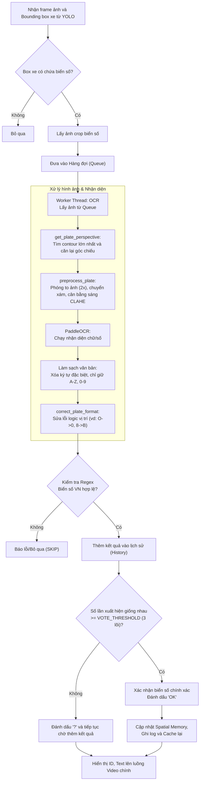
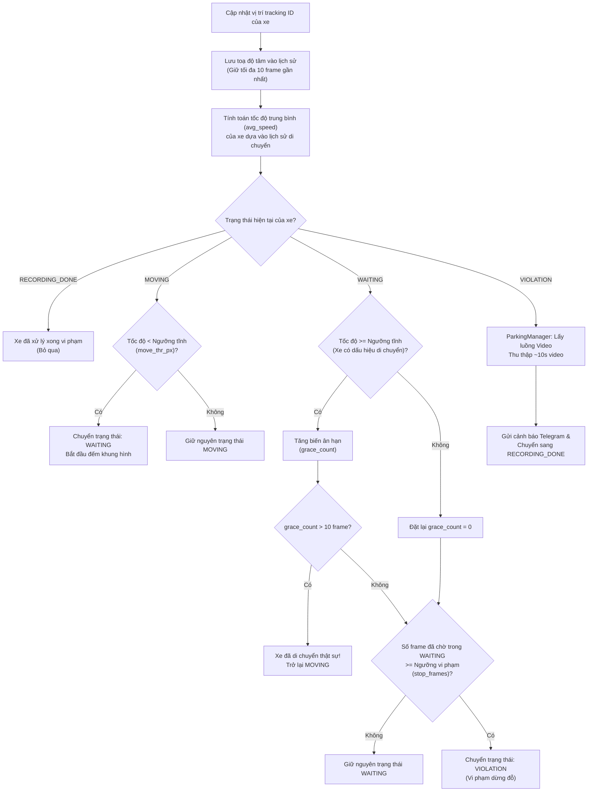
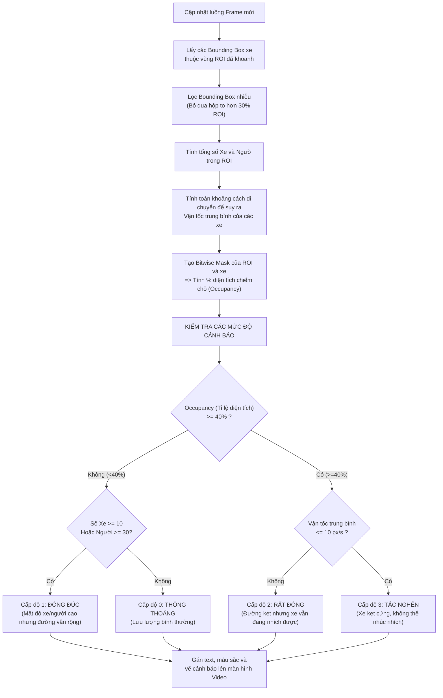

# Sơ đồ khối (Flowcharts) các chức năng chính

Dưới đây là sơ đồ luồng hoạt động (flowchart) cho 3 chức năng chính được lấy từ mã nguồn của dự án (thư mục `modules`):

## 1. Phát hiện và Nhận diện Biển số xe (OCR)

Luồng hoạt động của Module OCR (Dựa trên `ocr_processor.py` và `ocr_manager.py`).

---

## 2. Phát hiện xe dừng đỗ sai quy định (Parking Logic)

Luồng hoạt động của Module Kiểm tra Dừng đỗ (Dựa trên `parking_logic.py` và `parking_manager.py`).

---

## 3. Phát hiện tắc nghẽn giao thông (Traffic Monitor)

Luồng hoạt động của Module Đánh giá giao thông (Dựa trên `traffic_monitor.py`).

